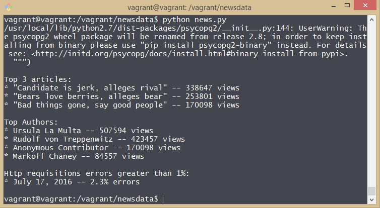

# Análise de Logs
Uma ferramenta de relatórios que imprime relatórios (em texto sem formatação) com base nos dados do banco de dados. Esta ferramenta de relatórios é um programa de Python usando o módulo psycopg2 para se conectar ao banco de dados.

## Pré-Requisitos

#### Use um terminal
Recomendo usar o terminal `Git Bash` que vem com o software Git.  
[Download do git](https://git-scm.com/downloads).

#### Instale a Virtual Box
Baixe e instale a [Virtual Box](https://www.virtualbox.org/wiki/Downloads).

#### Instale o Vagrant
Vargrant é o software que configura a VM e permite que você compartilhe arquivos entre seu computador host e o sistema de arquivos da VM. Instale a versão de seu sistema operacional.  
[Download do Vagrant](https://www.vagrantup.com/downloads.html).

Se for instalado com êxito, você será capaz de executar vagrant --version no seu terminal para ver o número da versão.

#### Instale o Python
[Download do python](https://www.python.org/downloads/release/python-2712/).

## Como ver a análise
#### Inicie a Máquina Virtual
1. Extraia os arquivos do zip `fsnd-virtual-machine.zip` que veio do repositório.
2. Vá para a pasta /vagrant pelo seu terminal.
3. Dentro da pasta digite `vagrant up` e espere o seu shell prompt voltar.
4. Com o prompt de volta digite `vagrant ssh` e ele irá logar no seu Linux VM recentemente instalado.

#### Importe o banco de dados
1. Você precisará descompactar o arquivo `newsdata.zip` que veio do repositório. O arquivo dentro é chamado de `newsdata.sql`.
2. Crie uma pasta no diretório /vagrant que é compartilhado com a máquina virtual e coloque o `newsdata.sql` dentro dela.
3. No terminal onde você já está logado na VM vá para o diretório onde você colocou o arquivo `newsdata.sql` e digite o comando `psql -d news -f newsdata.sql`.  
(Executar esse comando irá conectar você ao seu servidor de banco de dados instalado e executar os comandos SQL no arquivo baixado, criando tabelas e populando-as com dados.)

#### Crie as views necessárias para as consultas
1. Com o banco de dados importado, dentro do terminal já logado na VM digite o comando `psql news` para se conectar com o banco de dados news que acabou de ser importado.
2. Crie a primeira view chamada `views`:  
```sql
create view views as
select articles.author, articles.title, count(log.path) as views
from log,articles
where articles.slug = substring(log.path from 10)
and log.status like '%200%'
group by articles.title,articles.author
order by views desc;
```
3. Crie a segunda view chamada `httpreq`:  
```sql
create view httpreq as
select A.time, A.status, A.ocurr, B.total
from (select time::timestamp::date,status,count(*)as ocurr from log group by time::timestamp::date,status) as A,
(select time::timestamp::date,count(*)as total from log group by time::timestamp::date) as B
where A.time = B.time;
```
4. Desconecte do banco de dados usando o comando `ctrl + d`

#### Execute o arquivo python para receber os resultados
1. Coloque o arquivo `news.py` que veio no repositório na pasta onde você colocou o `newsdata.sql`.
2. Dentro do terminal já logado na VM e na pasta onde está o arquivo `news.py` execute o comando `python news.py` e ele te dará a seguinte análise:  
  - Os três artigos mais populares de todos os tempos.
  - Os autores de artigos mais populares de todos os tempos.
  - Em quais dias mais de 1% das requisições resultaram em erros.


